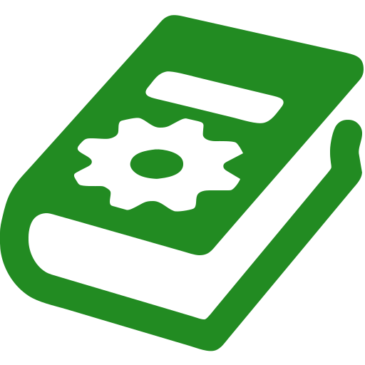

# {: style="height: 32px" } configlib-py

[
](https://pypi.org/project/config-library/)

utility library to find and load different kinds of configuration files.

[Getting Started](getting-started){: .btn .btn-blue .fs-5 }
{: .d-flex .flex-justify-around }

```python
from configlib import find_and_load

config = find_and_load('app.conf')
# config = find_and_load("app.json")  # format could be easily exchanged
# config = find_and_load("app.toml")  # depending on your needs and preferences
# config = find_and_load("app.yaml")  # and it should continue to work

address = config.get('database', 'address')
# address = config.getstr('database', 'address')  # also possible to ensure it's of type str
port = config.getint('database', 'port', fallback=5000)
```
